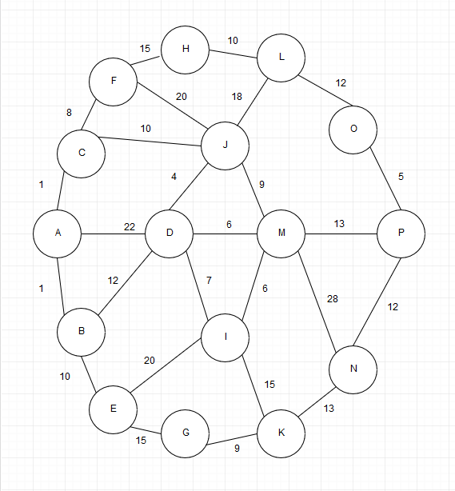
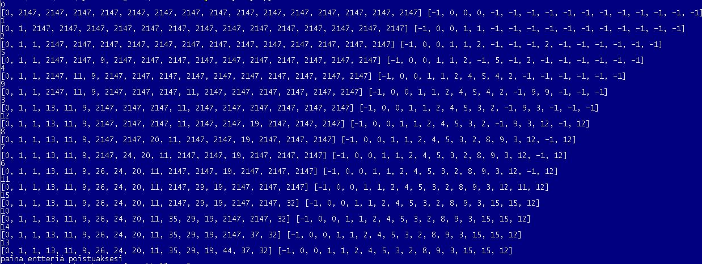

# Dijkstra
https://student.labranet.jamk.fi/~M2181/dijkstra/dijkstra.html

[koodiin](yritys.py)
Dijkstran algoritmi toteutettu Python-ohjelmointikielellä

verkko:

- Koodi antaa lyhimmät reitin nodelle sen indeksi paikalla ensimmäisissä sulkeissa
- Toisen sulkeen sisällä kerrotaan mistä nodesta indeksi paikan nodeen ollaan tultu.

